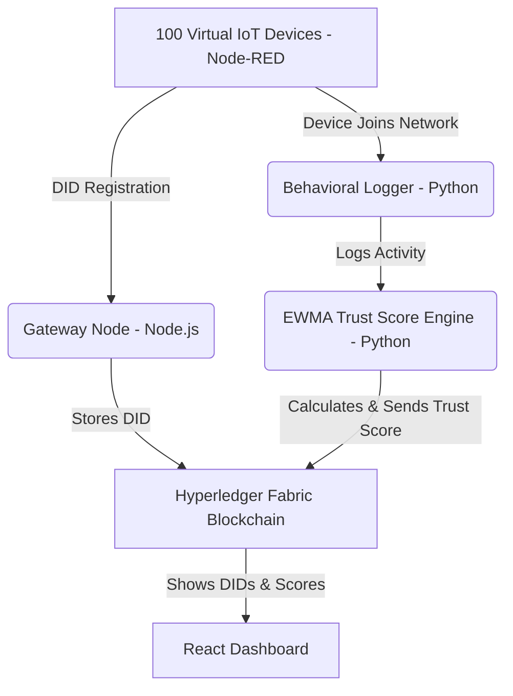

# IoT Trust System on Blockchain

This project implements a **Dynamic Trust Scoring for IoT Devices on Blockchain**, based on two base IEEE research papers. The system leverages Hyperledger Fabric to store decentralized identities (DIDs) and continuous, dynamically-calculated EWMA trust scores for IoT devices.

## Overview
Phase 1 of this project is the baseline implementation of two modules based on recent IEEE research:
1. **DID Registry Module (Paper 1):** Zaghdoudi et al. (IEEE DCOSS-IoT 2025)
2. **Trust Score Module (Paper 2):** Al-Zaidi et al. (IEEE IoT Journal 2026)

## System Architecture


## Setup & Installation

### Prerequisites
- Node.js (v18+)
- Python (v3.9+)
- Docker & Docker Compose
- Hyperledger Fabric (v2.5)

### Component 1: Hyperledger Fabric
1. Download Fabric binaries (2.5) into your environment.
2. Navigate to `fabric-network/`.
3. Run `./scripts/startNetwork.sh` to initialize the blockchain.

### Component 2: Chaincodes
Deploy the smart contracts:
```bash
cd chaincode/did-registry && npm install
cd ../trust-score && npm install
# Deploy via Fabric scripts...
```

### Component 3: Gateway Server
Run the REST API Gateway for device authentication:
```bash
cd gateway-server
npm install
node server.js
# Runs on port 3001
```

### Component 4: Trust Engine
Run the continuous trust calculation engine:
```bash
cd trust-engine
pip install -r requirements.txt
python behavioral_monitor.py
```

### Component 5: Node-RED IoT Simulator
Simulate 100 devices registering on the network:
```bash
cd node-red-flows
npm install
node setup_devices.js
```

### Component 6: Dashboard
Run the React dashboard to view live results:
```bash
cd dashboard
npm install
npm run dev
# Dashboard accessible at http://localhost:5173
```