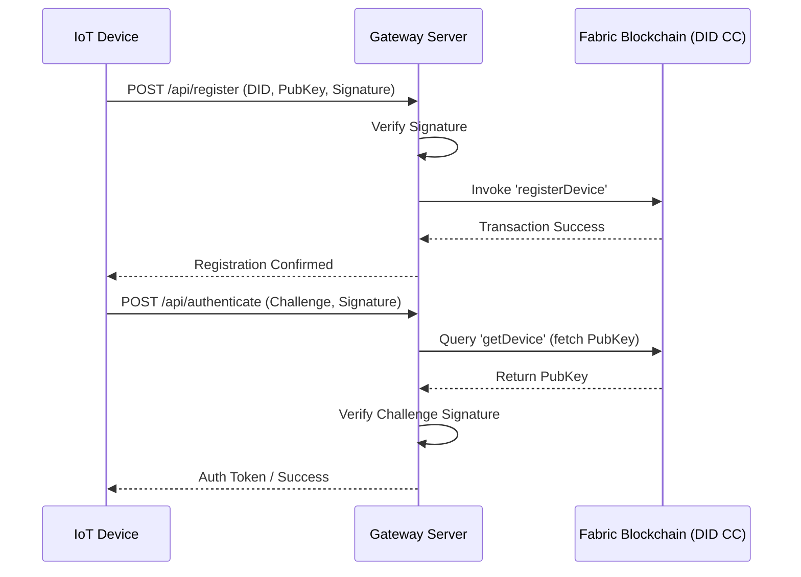
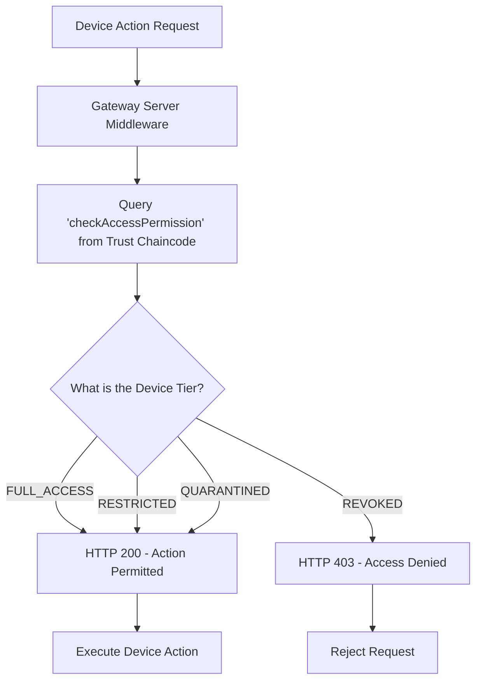
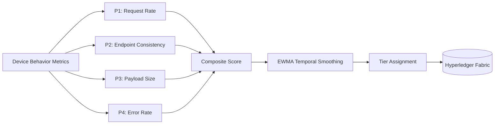

# IoT Trust System - Decentralized Identity and Trust Scoring

## 1. Overview
The IoT Trust System provides secure identity management and dynamic behavioral trust evaluation for IoT networks to detect and mitigate malicious activities. 

It builds upon two primary research frameworks:
* **Zaghdoudi et al., IEEE DCOSS-IoT 2025** ("Blockchain-Based Decentralized Identity System"): Forms the basis for Decentralized Identifier (DID) registration and authentication.
* **Al-Zaidi et al., IEEE Internet of Things Journal 2026** ("Trust Score Computation With Smart Contracts and Edge-Based Off-Chain Processing"): Provides the foundation for the Exponentially Weighted Moving Average (EWMA) trust scoring logic based on transaction success/failure ratios.

**Novel Contribution:** 
We introduce a **4-parameter behavioral scoring engine** tracking request rate, endpoint consistency, payload size, and error rate, coupled with **4-tier smart contract enforcement** (`FULL_ACCESS`, `RESTRICTED`, `QUARANTINED`, `REVOKED`) to effectively detect slow-poisoning and advanced behavioral attacks.

---

## 2. System Architecture

The system is distributed across three distinct layers, providing separation of concerns between immutable ledger storage, off-chain computation, and user interface.

```mermaid
graph TD
    subgraph Frontend Layer
        Dashboard[React/Vite Dashboard\n(Port 5173)]
    end

    subgraph Backend Layer
        Gateway[Node.js Gateway Server\n(Port 3001)]
        TrustEngine[Python Trust Engine\n(Port 3002)]
    end

    subgraph Blockchain Layer
        Fabric[Hyperledger Fabric Network]
        DID_CC[DID Registry Chaincode]
        Trust_CC[Trust Score Chaincode]
        EventListener[Fabric Event Listener]
    end

    IoT_Devices((IoT Devices)) -->|Register/Authenticate| Gateway
    IoT_Devices -->|Simulated Activity| TrustEngine
    
    Dashboard -->|Fetch Trust Scores| TrustEngine
    Dashboard -->|Listen to Events| EventListener
    
    Gateway <-->|Query/Invoke| Fabric
    TrustEngine -->|Submit Trust Scores| Fabric
    
    Fabric --- DID_CC
    Fabric --- Trust_CC
```

1. **Blockchain Layer (`iot-trust-fabric`)**: A Hyperledger Fabric network (with Certificate Authorities, Orderers, Peers, and CouchDB), smart contracts (`did-registry`, `trust-score`), and an event listener to push blockchain events locally.
2. **Backend Layer (`gateway-server` & `trust-engine`)**: 
   * The Node.js Express `gateway-server` processes DID registrations, performs authentication, and handles tier-gated device actions.
   * The Python Flask `trust-engine` computes EWMA trust scores off-chain, monitors the novel 4-parameter behavioral logic, and pushes immutability updates to the blockchain.
3. **Frontend Layer (`dashboard`)**: A React and Vite web dashboard that monitors real-time device trust scores, system health, and behavioral parameters.

---

## 3. Core Workflows

### 3.1 DID Registration and Authentication
Based on the Zaghdoudi et al. (2025) paper, devices must register their Decentralized Identifier (DID) and authenticate before they can interact with the network.


```mermaid
sequenceDiagram
    participant Device as IoT Device
    participant Gateway as Gateway Server
    participant Fabric as Fabric Blockchain (DID CC)
    
    Device->>Gateway: POST /api/register (DID, PubKey, Signature)
    Gateway->>Gateway: Verify Signature
    Gateway->>Fabric: Invoke 'registerDevice'
    Fabric-->>Gateway: Transaction Success
    Gateway-->>Device: Registration Confirmed
    
    Device->>Gateway: POST /api/authenticate (Challenge, Signature)
    Gateway->>Fabric: Query 'getDevice' (fetch PubKey)
    Fabric-->>Gateway: Return PubKey
    Gateway->>Gateway: Verify Challenge Signature
    Gateway-->>Device: Auth Token / Success
```

### 3.2 4-Tier Access Control Enforcement
When a device requests to perform an action, the Gateway intercepts the request and verifies the device's trust tier from the blockchain.


```mermaid
flowchart TD
    Req[Device Action Request] --> Gateway[Gateway Server Middleware]
    Gateway --> Query[Query 'checkAccessPermission' from Trust Chaincode]
    Query --> Tier{What is the Device Tier?}
    
    Tier -->|FULL_ACCESS| Allow[HTTP 200 - Action Permitted]
    Tier -->|RESTRICTED| Allow
    Tier -->|QUARANTINED| Allow
    Tier -->|REVOKED| Block[HTTP 403 - Access Denied]
    
    Allow --> Execute[Execute Device Action]
    Block --> Reject[Reject Request]
```

### 3.3 Dynamic Trust Score Computation
The Python Trust Engine evaluates device behavior, computes the score, and logs it to the immutable ledger.


```mermaid
flowchart LR
    Behavior[Device Behavior Metrics] --> P1[P1: Request Rate]
    Behavior --> P2[P2: Endpoint Consistency]
    Behavior --> P3[P3: Payload Size]
    Behavior --> P4[P4: Error Rate]
    
    P1 --> Composite[Composite Score]
    P2 --> Composite
    P3 --> Composite
    P4 --> Composite
    
    Composite --> EWMA[EWMA Temporal Smoothing]
    EWMA --> TierAssignment[Tier Assignment]
    TierAssignment --> Blockchain[(Hyperledger Fabric)]
```

---

## 4. Folder Structure

```
BTP/
├── dashboard/          - React+Vite frontend UI for visualizing trust scores and tiers.
├── gateway-server/     - Node.js API server handling DID operations and 4-tier access control.
├── iot-trust-fabric/   - Hyperledger Fabric network configurations, deployment scripts, and chaincodes.
├── node-red-flows/     - Node-RED visual flows for testing integrations.
├── research-paper/     - LaTeX source files for the research documentation.
└── trust-engine/       - Python engine for off-chain trust computation and attack simulation.
```

---

## 5. Prerequisites

The following runtimes and tools must be installed:
* **Docker** (20.x+) & **Docker Compose** (2.x+)
* **Node.js** (18.x+) & **npm** (Required packages: `express`, `cors`, `fabric-ca-client`, `fabric-network`, `react`, `vite`)
* **Python** (3.x) & **pip** (Required packages: `requests==2.31.0`, `flask==3.0.0`, `flask-cors==4.0.0`)
* **Go** (1.20+) (Required for Fabric configuration tools)

---

## 6. Setup and Run Instructions

Run these components in the exact order below.

### Step 1: Start the Fabric Network
```bash
# Setup Docker (Ubuntu/Debian) - Run once
cd iot-trust-fabric
sudo ./setup-docker.sh

# Bootstrap the network
cd fabric-network
chmod +x scripts/*.sh
./scripts/bootstrap.sh
./scripts/create-channel.sh
./scripts/deploy-did.sh
./scripts/deploy-trust.sh
```

### Step 2: Start the Event Listener
```bash
cd ../event-listener
npm install
node listener.js
```

### Step 3: Start the Gateway Server
```bash
cd ../../gateway-server
npm install
npm start
```
*Runs on port: `3001`*

### Step 4: Start the Trust Engine API
```bash
cd ../trust-engine
pip install -r requirements.txt
python api_server.py
```
*Runs on port: `3002`. The background device simulation automatically starts in a background daemon thread.*

### Step 5: Start the Dashboard
```bash
cd ../dashboard
npm install
npm run dev
```

---

## 7. How to Run the Attack Simulation

The attack simulator evaluates system resilience against Sybil, Replay, Man-in-the-Middle, and Slow Poison attacks. It specifically compares the baseline Al-Zaidi 2-parameter model against the novel 4-parameter behavioral model.

```bash
cd trust-engine
python attack_simulator.py
```
This generates a detailed command-line table showing the cycle at which each attack model successfully detects and blacklists malicious devices, along with False Positive Rate statistics.

---

## 8. API Reference

### Gateway Server (`http://localhost:3001`)
* `POST /api/register`: Registers a device's DID on the blockchain.
* `POST /api/authenticate`: Authenticates a device.
* `GET /api/devices`: Lists all registered devices.
* `GET /api/device/:deviceId`: Retrieves information for a specific device.
* `GET /api/health`: Health check returning device count and paper reference.
* `POST /api/device/:deviceId/action`: Performs an action guarded by the 4-tier chaincode access control logic.

### Trust Engine API (`http://localhost:3002`)
* `GET /api/trust/all`: Retrieves standard EWMA trust scores for all devices.
* `GET /api/trust/<device_id>`: Retrieves the trust score for a specific device.
* `GET /api/trust/history/<device_id>`: Retrieves historical score updates.
* `POST /api/trust/update`: Internal endpoint receiving blockchain updates.
* `GET /api/stats`: Displays overall system statistics.
* `GET /api/trust/v2/all`: Retrieves V2 4-parameter composite scores for all devices.
* `GET /api/trust/v2/tier/<tier_name>`: Filters devices by their calculated tier (`FULL_ACCESS`, `RESTRICTED`, `QUARANTINED`, `REVOKED`).
* `GET /api/trust/v2/comparison`: Runs attack comparison returning detection cycles for Phase 1 vs Phase 2.
* `GET /api/health`: Health check returning service status.

---

## 9. The Trust Score Formula

### Phase 1: Baseline EWMA Formula (Al-Zaidi et al.)
```python
T_new = (alpha * T_prev) + ((1 - alpha) * (S / (S + F + 1))) - (beta * M)
Normalized = max(0.0, min(1.0, T_new))
```
**Code Constants:** `alpha = 0.6`, `beta = 0.3`, `t_min = 0.2`, `t_max = 0.8`
*(S: Successful Tx, F: Failed Tx, M: Malicious count)*

### Phase 2: Novel 4-Parameter Composite Formula
```python
Composite_Score = (w1 * p1) + (w2 * p2) + (w3 * p3) + (w4 * p4)
T_new = (alpha * T_prev) + ((1 - alpha) * Composite_Score)
Normalized = max(0.0, min(100.0, T_new))
```
**Parameters & Weights:**
* `p1`: Request Rate (`w1 = 0.35`)
* `p2`: Endpoint Consistency (`w2 = 0.30`)
* `p3`: Payload Size (`w3 = 0.20`)
* `p4`: Error Rate (`w4 = 0.15`)
*(Initial Learning Threshold requires 3 cycles to establish standard deviation baselines before active scoring).*

---

## 10. Research Papers

1. **Zaghdoudi, B., et al.** "Blockchain-Based Decentralized Identity System", IEEE DCOSS-IoT 2025.
2. **Al-Zaidi, R., et al.** "Trust Score Computation With Smart Contracts and Edge-Based Off-Chain Processing", IEEE Internet of Things Journal 2026.

---

## 11. Troubleshooting

* **Wrong Channel Name:** If chaincode interactions fail, verify that scripts and gateway applications reference `iot-channel` exactly as configured in `configtx.yaml`.
* **Path Resolution Errors:** If the gateway server fails to start due to identity issues, check `connection-profile.json` and ensure cryptographic paths correctly point to absolute locations within `iot-trust-fabric/fabric-network/crypto-config`.
* **Port Conflicts:** The Hyperledger Fabric network and CouchDB require ports `7050`, `7051`, `7053`, `7054`, and `5984` to be free. Validate this using `sudo lsof -i :7050 -i :7051 -i :7053 -i :7054 -i :5984` before bootstrapping.
* **WSL vs Windows Binary Issues:** Ensure all scripts run entirely within WSL avoiding Windows symlinks. Apply `chmod +x` natively inside the WSL shell before executing `bootstrap.sh`. Docker volumes mounted across OS file systems can sometimes corrupt Fabric peer data.